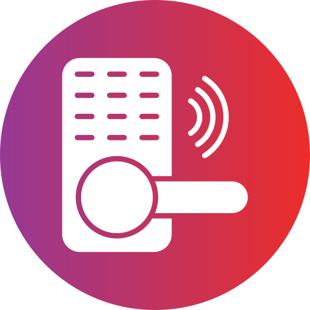

# Smart Door Lock System

<div align="center">
  
  <br>
  <em>Advanced Security System with Smart Lock System</em>
  <br><br>
  
  [](LICENSE)
  [](https://github.com/yourusername/smart-lock-hardware)
  [](https://www.espressif.com/)
</div>

## 📋 Overview

Smart Door Lock is a comprehensive IoT security system that enhances traditional door locks with advanced features such as facial recognition, fingerprint authentication, RFID card access, and remote control capabilities. The system offers multiple authentication methods, real-time monitoring, and seamless integration with mobile and web applications.

### 🔐 Key Features

- **Multi-factor Authentication**:
  - Facial Recognition
  - Fingerprint Scanning
  - RFID Card Access

- **Remote Operation**:
  - Lock/Unlock via Mobile App
  - Real-time Status Monitoring
  - Access Logs and History

- **Enhanced Security**:
  - Emergency Lock System
  - Failed Attempts Protection
  - Tamper Detection
  - Motion Sensing

- **Advanced User Interface**:
  - Color TFT Display
  - Professional Animations
  - Intuitive Status Indicators
  - Responsive Touch Controls

## 🛠️ Hardware Components

- **Microcontroller**: ESP32 (Dual-Core, WiFi & Bluetooth)
- **Biometric**: Fingerprint Sensor Module
- **Identification**: RFID Reader (MFRC522)
- **Display**: 240x320 TFT Touch Screen
- **Camera**: ESP32-CAM for Facial Recognition
- **Connectivity**: WiFi Module for Cloud Connection
- **Storage**: EEPROM from ESP32 for User Data
- **Power**: 12V DC
- **Actuator**: Servo Motor or Solenoid for Lock Mechanism
- **Auxiliary**: Buzzer, LEDs, Motion Sensor

## 📊 System Architecture

```
┌─────────────────────────────────────┐     ┌─────────────────────┐
│         Hardware Components         │     │                     │
│  ┌───────────┐    ┌───────────┐     │     │                     │
│  │ ESP32 Main│◄───┤ESP32-CAM  │     │     │                     │
│  │ Controller│    │Facial Rec.│     │     │                     │
│  └─────┬─────┘    └───────────┘     │     │                     │
│        │                            │     │                     │
│  ┌─────┴─────┐    ┌───────────┐     │     │    AWS IoT Core     │
│  │ Sensors & │◄───┤ Lock      │     │◄───►│    & Services       │
│  │ Interfaces│    │ Mechanism │     │     │                     │
│  └───────────┘    └───────────┘     │     │                     │
│                                     │     │                     │
└─────────────────────────────────────┘     └─────────────────────┘
                                                       ▲
                                                       │
                                                       ▼
                                            ┌─────────────────────┐
                                            │                     │
                                            │   Web Dashboard     │
                                            │                     │
                                            └─────────────────────┘
```

## 🔧 Installation

### Prerequisites

- [Visual Studio Code](https://code.visualstudio.com/)
- [PlatformIO IDE Extension](https://platformio.org/install/ide?install=vscode)
- [Git](https://git-scm.com/downloads)
- [AWS IoT Account](https://aws.amazon.com/iot-core/) (for cloud functionality)

### Building the Project

1. Clone the repository:
   ```
   git clone https://github.com/yourusername/smart-lock-hardware.git
   cd smart-lock-hardware
   ```

2. Open the project in VS Code with PlatformIO:
   ```
   code .
   ```

3. Copy and configure credential files:
   - Create a copy of `include/secrets.h.example` as `include/secrets.h`
   - Fill in your AWS IoT and WiFi credentials

4. Build the project:
   - Using PlatformIO UI: Click the "Build" button
   - Using command line: `pio run`

5. Upload to your ESP32:
   - Connect your ESP32 via USB
   - Using PlatformIO UI: Click the "Upload" button
   - Using command line: `pio run --target upload`

### Project Dependencies

All dependencies are automatically managed by PlatformIO and defined in `platformio.ini`:

```ini
[env:esp32dev]
platform = espressif32
board = esp32dev
framework = arduino
monitor_speed = 115200
lib_deps = 
    bodmer/TFT_eSPI @ ^2.5.31
    knolleary/PubSubClient @ ^2.8.0
    bblanchon/ArduinoJson @ ^6.21.3
    miguelbalboa/MFRC522 @ ^1.4.10
    adafruit/Adafruit Fingerprint Sensor Library @ ^2.1.2
    links2004/WebSockets @ ^2.4.1
```

### Wiring and Hardware Setup

1. Follow the wiring diagram in `docs/hardware/wiring.pdf` for connecting:
   - ESP32 Main Board
   - ESP32-CAM Module
   - TFT Display
   - RFID Reader
   - Fingerprint Sensor
   - Lock Mechanism
   - Motion Sensor
   - LEDs and Buzzer

2. Power the system with 12V DC power supply

### AWS IoT Setup

1. Create an AWS IoT thing in the AWS IoT Core console
2. Generate and download certificates for your device
3. Place the certificates in the project's `certs` folder:
   - `certificate.pem.crt`
   - `private.pem.key`
   - `root-CA.crt`
4. Update the AWS IoT endpoint in `secrets.h`

## 📱 Usage

### Device Setup

1. Power on the device and it will enter setup mode on first boot
2. Connect to the device's WiFi access point "SmartLock-Setup"
3. Navigate to `192.168.4.1` in your web browser
4. Follow the on-screen instructions to configure WiFi and AWS IoT credentials

### Authentication Methods

- **Face Recognition**: Look at the camera from a distance of 30-50cm
- **Fingerprint**: Place your registered finger on the sensor
- **RFID Card**: Tap your registered card against the reader
- **Remote Access**: Use the mobile or web application

### User Management

- Add or remove users through the web dashboard
- Assign specific access methods to each user
- Set access schedules and restrictions

## 🧩 Code Structure

```
smart-lock-hardware/
├── lib/                         # Libraries
│   ├── aws/                     # AWS IoT integration
│   ├── button/                  # Button handling
│   ├── eeprom_manager/          # EEPROM data management
│   ├── face_recognition/        # Facial recognition
│   ├── fingerprint/             # Fingerprint authentication
│   ├── lock/                    # Lock mechanism control
│   ├── mqtt/                    # MQTT communication
│   ├── rfid/                    # RFID card handling
│   └── user_interface/          # User interface components
├── include/                     # Header files
│   ├── config.h                 # Configuration parameters
│   └── secrets.h                # Security credentials
├── src/                         # Source code
│   └── main.cpp                 # Main application entry
├── platformio.ini               # PlatformIO configuration
└── README.md                    # This file
```

## 🔄 State Machine Logic

The system operates on a state machine pattern with these main states:

1. **IDLE**: Waiting for user interaction
2. **AUTHENTICATING**: Processing credentials
3. **UNLOCKED**: Door is unlocked
4. **LOCKED**: Door is locked
5. **EMERGENCY_LOCK**: System is locked due to security policy
6. **CONFIGURATION**: System is in setup mode

## 🔌 Communication Protocols

- **MQTT**: For cloud communication with AWS IoT Core
- **WebSockets**: For real-time video streaming and face recognition
- **SPI**: For communication with RFID reader and display
- **I2C**: For sensors and peripheral components

## 💾 Data Management

- **User Data**: Stored in external EEPROM
- **Access Logs**: Sent to AWS IoT Core and stored in DynamoDB
- **Configurations**: Saved in non-volatile memory
- **Credentials**: Securely stored with encryption

## 🔐 Security Measures

- **Data Encryption**: All communications use TLS/SSL
- **Secure Boot**: Firmware verification on startup
- **Certificate-based Authentication**: For AWS IoT connections
- **Anti-tamper Mechanism**: Physical security measures
- **Brute Force Protection**: Temporary lockout after failed attempts

## 🤝 Contributing

We welcome contributions to improve the Smart Door Lock system!

1. Fork the repository
2. Create a new branch (`git checkout -b feature/amazing-feature`)
3. Make your changes
4. Commit your changes (`git commit -m 'Add some amazing feature'`)
5. Push to the branch (`git push origin feature/amazing-feature`)
6. Open a Pull Request

## 📜 License

This project is licensed under the MIT License - see the [LICENSE](LICENSE) file for details.

## 🙏 Acknowledgements

- [ESP32 Community](https://esp32.com/)
- [AWS IoT Documentation](https://docs.aws.amazon.com/iot/)
- [Arduino Community](https://www.arduino.cc/)
- All the contributors and testers who made this project possible

---

<div align="center">
  <h2>Smart Lock System</h2>
  <p>An advanced security solution designed for modern enterprises and homes. Featuring multi-factor authentication with fingerprint, face recognition and RFID technologies.</p>
  
  <br>
  ⚡
  <br><br>
  
  <p><strong>Designed by Tran Dai Vi - N22DCCI044</strong></p>
  <p>Posts and Telecommunications Institute of Technology (PTIT)</p>
  
  <p>
    <i>Smart Door Lock System © 2023 - Enhancing home security with modern technology</i>
  </p>
  
</div> 